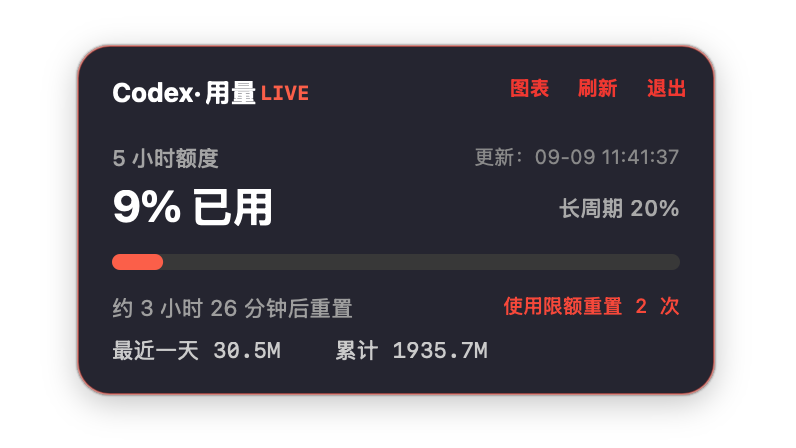

# Codex Usage Widget

一个运行在 macOS 上的 Codex 用量浮窗，可以显示在 Codex 旁边，持续查看账户用量。

English：[README.md](README.md)



## 功能

- 显示 5 小时额度使用比例、重置时间和长周期额度。
- 5 小时额度到达重置时间时发送 macOS 本地通知，首次启动时会请求通知权限。
- 显示数据更新时间，精确到秒。
- 正常更新间隔为 30 秒；更新失败后每 1 秒重试一次。
- 支持手动刷新、隐藏、退出和历史图表；隐藏只收起浮窗，数据仍会继续更新，点击菜单栏用量 widget 可以重新显示。
- 同时提供 macOS 桌面 Widget，支持小尺寸和中尺寸，显示与浮窗一致的核心用量；点击 Widget 可打开浮窗。
- 历史图表支持 24 小时、7 天、30 天和全部数据筛选，也可以选择主周期、长周期或全部指标。
- 显示可用的“使用限额重置”次数，点击后查看每条重置额度的标题和到期时间。
- 支持选择自定义背景图片和调整图片透明度，原有深色主题会继续保留。
- 支持在外观设置中切换中文和 English，默认使用中文，选择会保存在本机。
- macOS 桌面 Widget 会跟随当前语言切换并刷新；没有语言标记的旧本地历史继续默认显示中文。
- 支持拖动面板贴近屏幕边缘后自动缩放为极简卡片，极简模式显示 5 小时和长周期额度；鼠标悬停时恢复完整面板。
- 设置面板可以关闭自动缩放，并设置等待 1–10 秒后缩放，默认开启、默认等待 2 秒。
- 菜单栏支持显示实时用量，格式为 `CODEX(5h:42%|1W:18%)`，默认开启。
- 使用 `assets/icon.png` 生成应用图标。
- 每次成功获取的数据都会追加保存到本地历史文件，更新 App 不会删除历史数据。

## 隐私与网络声明

本项目只在 macOS 本机运行。本应用自身不会发起任何外网请求，不包含遥测、数据分析、广告、跟踪或云端同步行为。

应用只通过本地进程以只读方式调用本机 `codex app-server`，不会读取、复制或保存登录凭据、提示词、文件或其他用户内容。用量历史只保存在用户本机的应用支持目录中。

桌面 Widget 只读取该本地历史文件中的最新用量快照，不会连接 `codex app-server`，也不会读取登录凭据或其他用户内容。

独立运行的 Codex app-server 可能有其自身的联网行为；该行为不属于本应用代码，也不受本项目控制。以上声明针对 Codex Usage Widget 本身。

## 安装和启动

项目提供两种产物：

- `AppBundle/Codex Usage Widget.app`：应用本体。
- `AppBundle/Codex Usage Widget.dmg`：安装镜像。

使用 Xcode 开发时，直接打开 `CodexUsageWidget.xcodeproj`。其中的
`Codex Usage Widget` scheme 会构建 AppKit 宿主并嵌入 `Codex Usage Widget Desktop`
扩展。工程默认使用 ad-hoc 签名，并与 `build.zsh` 共用现有 Info.plist 和 entitlements。

可以双击 DMG，将 App 拖入应用程序目录，也可以直接打开 App：

```zsh
open "AppBundle/Codex Usage Widget.app"
```

## 构建

项目不依赖 Xcode 工程或第三方 Swift 包，使用项目根目录下的脚本构建：

```zsh
./build.zsh
```

构建脚本会完成以下工作：

1. 使用 `xcrun swiftc` 编译 Swift/AppKit 应用。
2. 使用 SwiftUI/WidgetKit 编译 macOS 桌面 widget 扩展。
3. 从 `assets/icon.png` 生成多分辨率 `AppIcon.icns`。
4. 生成并签名包含 widget 扩展的 `.app` 应用包。
5. 生成 `AppBundle/Codex Usage Widget.dmg` 安装镜像。

最低支持 macOS 13.0。

桌面 Widget 在彩色模式使用深色背景，非聚焦/单色模式使用系统背景与自适应前景色，保留
单层内容边距。图库使用示例数据预览，添加到桌面后
读取主应用的本地用量历史。

## 数据和配置

历史数据保存位置：

```text
~/Library/Application Support/Codex Usage Widget/usage-history.jsonl
```

背景图片路径、图片透明度、自动缩放、缩放等待时间和菜单栏显示开关保存在当前用户的 `UserDefaults` 中。

默认 Codex 可执行文件路径为：

```text
/Applications/ChatGPT.app/Contents/Resources/codex
```

如果 Codex 安装在其他位置，运行应用时可以通过 `CODEX_BIN` 指定：

```zsh
CODEX_BIN="/path/to/codex" "AppBundle/Codex Usage Widget.app/Contents/MacOS/CodexUsageWidget"
```

## 无界面检查

可以使用一次性模式获取经过清理的用量快照并退出：

```zsh
"AppBundle/Codex Usage Widget.app/Contents/MacOS/CodexUsageWidget" --once
```

该模式不会启动浮窗和菜单栏状态项。
它也不会初始化 AppKit 或 WidgetKit，因此不会把工作区构建产物登记为重复的桌面 Widget 提供方。

## macOS 26 的隐私保护签名

构建脚本使用与 Xcode 扩展一致的 `_NSExtensionMain` 启动入口。缺少此入口时，扩展虽能
成功注册，但在 macOS 26 上会在响应图库请求前退出。因此，仅检查签名和注册成功不能
证明 Widget 已能在图库中显示。

默认构建使用 ad-hoc 签名，因此公开发布的 App 和 DMG 不会嵌入 Apple 开发者姓名、邮箱或
Team ID：

```zsh
./build.zsh
```

构建完成后，脚本会检查宿主 App 和 WidgetKit 扩展；如果意外包含 Apple 签名机构或 Team ID，
构建将直接失败。该检查只保护安装产物，不会删除 Git 历史中已经记录的提交者邮箱。

ad-hoc 安装包无法完成 Apple 公证，用户首次启动时可能需要手动允许。桌面 Widget 是否可用
仍需在目标 macOS 版本实测；扩展继续使用 macOS 26 所需的原生 `_NSExtensionMain` 入口。

安装或启动 App 后，可以在 macOS 桌面 Widget 图库中添加“Codex 用量”。图库按宿主 App
显示名搜索，请搜索完整名称“Codex 用量”。Widget 已随 App 一起打包为 WidgetKit 扩展。

如果之前已经安装过旧版本，需要用最新构建产物替换旧的 App，再重新启动一次；WidgetKit
会按新的版本号重新注册桌面 Widget。

## 项目结构

- `Sources/CodexUsageWidget.swift`：应用主体、AppKit UI、Codex app-server 客户端、历史记录、图表、设置和菜单栏状态项。
- `Sources/CodexUsageDesktopWidget.swift`：macOS WidgetKit 桌面 widget，显示与浮窗一致的核心用量。
- `AppBundle/Contents/Info.plist`：应用 Bundle 元数据。
- `AppBundle/Widget/Info.plist`：桌面 widget 扩展元数据。
- `AppBundle/Widget/Entitlements.plist`：桌面 widget 的沙盒和本地历史只读权限。
- `assets/icon.png`：应用图标源文件。
- `build.zsh`：构建 `.app` 和 `.dmg` 的标准脚本。
